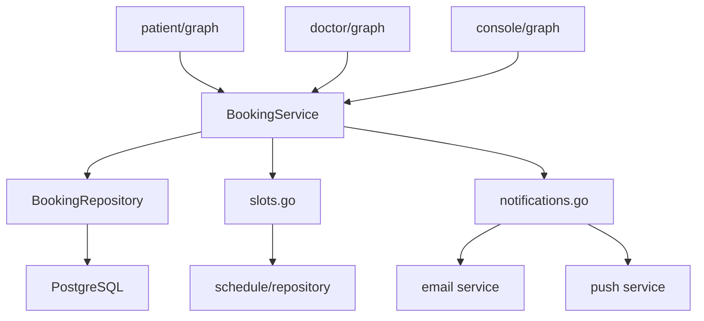
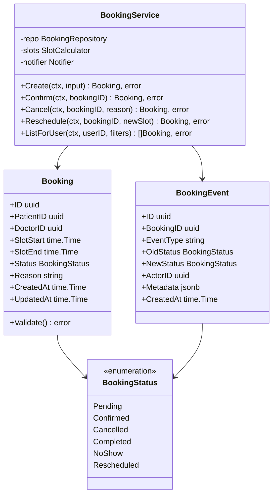
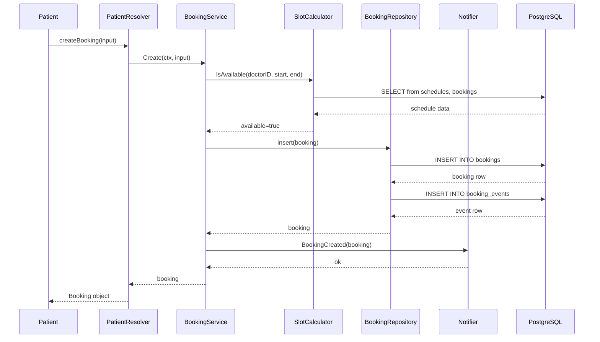
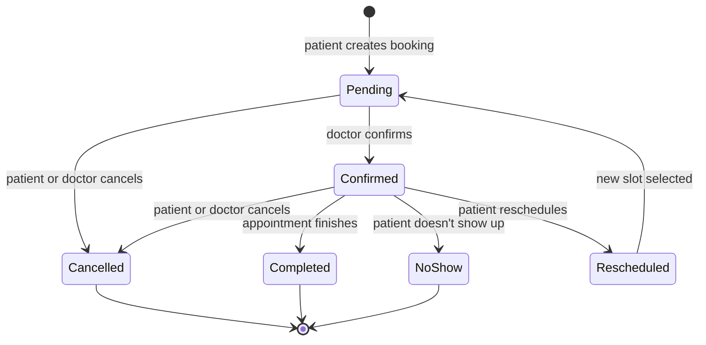
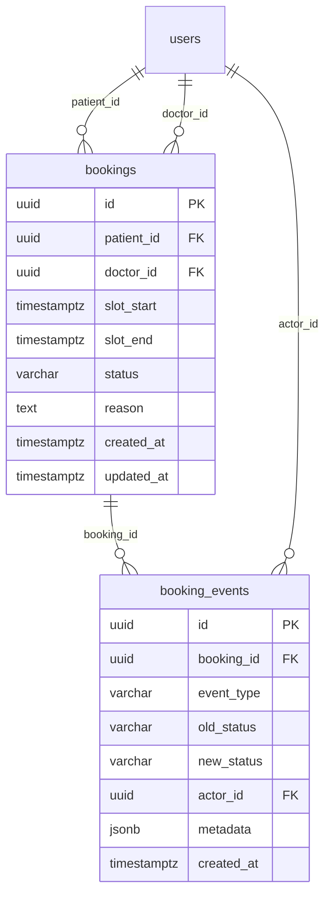

# README Example

Below is a realistic example of a filled-in README.md for a fictional `server/internal/booking/` module. Use this as a reference for tone, detail level, and diagram usage.

---

```markdown
---
module: booking
purpose: Booking lifecycle management — creating, confirming, cancelling, and rescheduling patient appointments
last-updated: 2026-02-10
---

# Booking

Handles the full lifecycle of patient appointment bookings. This module owns the `bookings` and `booking_events` database tables and exposes its functionality through repository functions consumed by the GraphQL resolver layers (patient, doctor, console).

The booking system uses an event-sourced pattern: every state change produces a `booking_event` record, enabling audit trails and undo operations. The `BookingService` orchestrates business rules while `BookingRepository` handles persistence.

## Files

| File | Description |
|------|-------------|
| service.go | BookingService with Create, Confirm, Cancel, Reschedule, and ListForUser operations |
| repository.go | SQL queries against bookings and booking_events tables using pgx v5 |
| model.go | Booking, BookingEvent, and BookingStatus domain types with validation methods |
| errors.go | Domain-specific error types (ErrSlotTaken, ErrBookingNotFound, ErrInvalidTransition) |
| notifications.go | Notification triggers for booking state changes (email and push) |
| slots.go | Available slot calculation logic — checks doctor schedules against existing bookings |

## Diagrams

### Module Dependencies



### Data Structures



### Booking Creation Flow



### Booking Status Transitions



### Database Schema



## Notes

- All booking mutations run inside a database transaction that inserts both the booking update and the corresponding event atomically.
- The `SlotCalculator` uses a 15-minute granularity by default. This is configurable per doctor via the schedules table.
- Cancellation within 24 hours of the appointment triggers a different notification template than early cancellations.
- The `Rescheduled` status is transient — it immediately creates a new `Pending` booking for the new slot and links them via `booking_events.metadata`.
```
