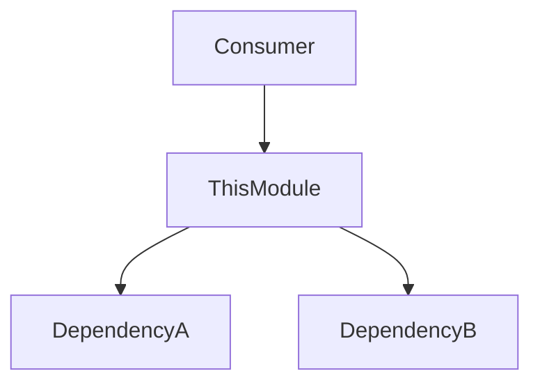
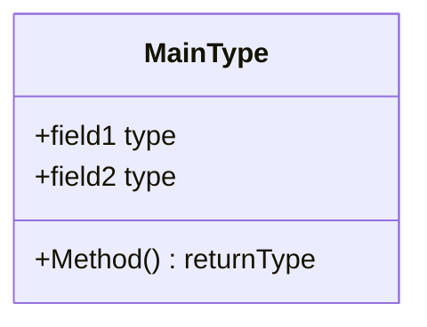
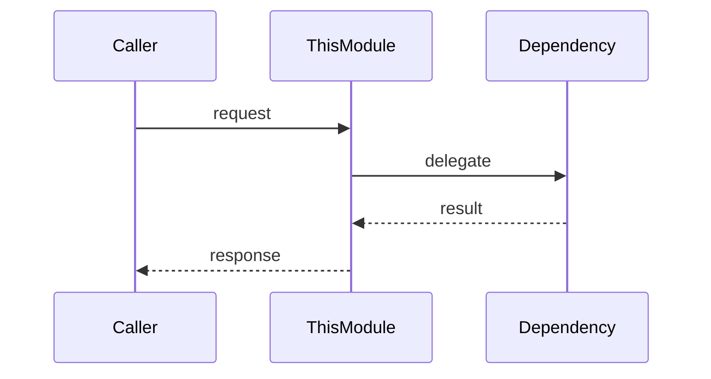

# README Template

Copy the content below (between the horizontal rules) into a new README.md file and fill in each section.

---

```markdown
---
module: directory-name
purpose: One-sentence description of what this directory contains and why it exists
last-updated: YYYY-MM-DD
---

# Module Name

Brief overview (2-4 sentences): what this module does, how it fits into the system, and key design decisions.

## Files

| File | Description |
|------|-------------|
| file-a.ext | What this file does |
| file-b.ext | What this file does |
| file-c.ext | What this file does |

## Diagrams

### Dependencies



### Data Structures



### Flow



## Notes

- Any conventions, gotchas, or patterns specific to this module
- Migration notes or historical context if relevant
```

---

## Section Guide

| Section | Required | When to include |
|---------|----------|-----------------|
| Frontmatter | Always | Every README.md |
| Overview paragraph | Always | Every README.md |
| Files table | Always | Every README.md (unless directory has only 1 file) |
| Flowchart | Usually | When the module has dependencies on or consumers from other modules |
| Class diagram | Sometimes | When the module defines data structures, interfaces, or types |
| Sequence diagram | Sometimes | When the module handles multi-step processes or API flows |
| State diagram | Sometimes | When the module manages state transitions |
| ER diagram | Sometimes | When the module owns database tables |
| Notes | Sometimes | When there are non-obvious conventions or gotchas |
