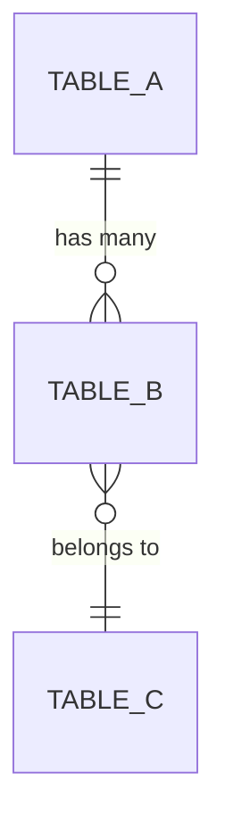
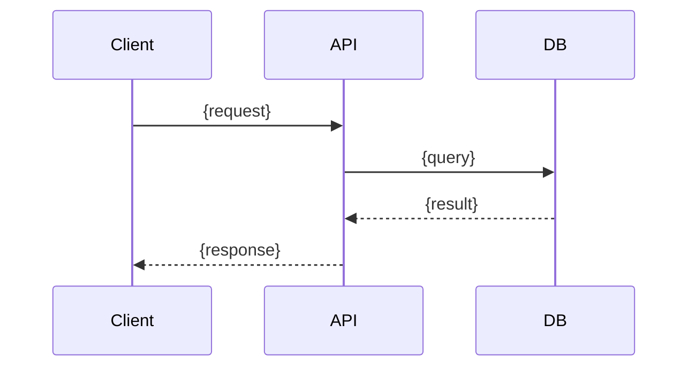
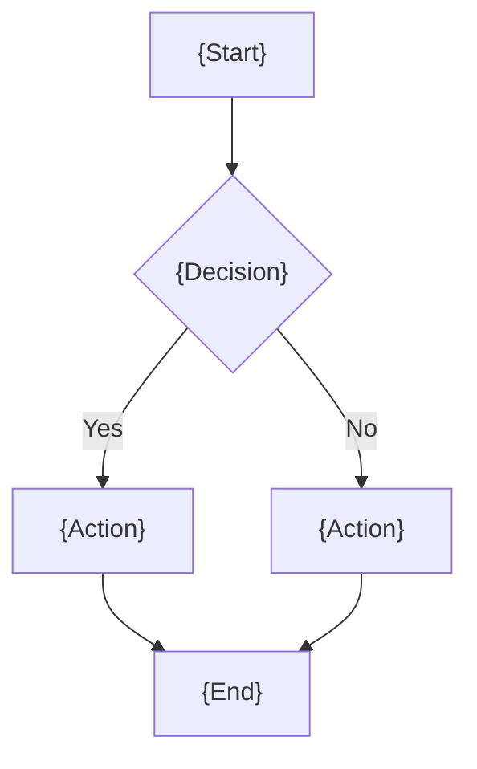

# Specification: {Feature Name}

**Spec ID:** {YYYYMMDD-HHmm-slug}
**Status:** Draft | In Review | Approved
**Created:** {YYYY-MM-DD}
**Last Updated:** {YYYY-MM-DD}

---

## 1. Overview

### 1.1 Feature Description

{2-3 paragraphs describing what this feature does at a technical level. Reference the requirements document for business context.}

For detailed requirements, see [requirements.md](./requirements.md).

### 1.2 Strategic Alignment

| Aspect | Alignment |
|--------|-----------|
| Mission | {how this supports the product mission} |
| Roadmap | {where this sits on the roadmap} |
| Success Metrics | {which metrics this impacts} |

### 1.3 User Value

| User Type | Value Delivered |
|-----------|-----------------|
| {user type} | {value} |

### 1.4 Success Criteria

| Criterion | Target | Measurement |
|-----------|--------|-------------|
| {criterion} | {target} | {how measured} |

---

## 2. Requirements Summary

### 2.1 Functional Requirements

| ID | Requirement | Priority |
|----|-------------|----------|
| FR-{tag}-001 | {requirement} | {priority} |

### 2.2 Non-Functional Requirements

| ID | Requirement | Target |
|----|-------------|--------|
| NFR-{tag}-001 | {requirement} | {target} |

### 2.3 Constraints

| Constraint | Description |
|------------|-------------|
| {constraint} | {description} |

### 2.4 Out of Scope

| Feature | Rationale |
|---------|-----------|
| {feature} | {why excluded} |

---

## 3. Data Models

### 3.1 {Table/Entity Name}

```sql
CREATE TABLE {table_name} (
    id UUID PRIMARY KEY DEFAULT gen_random_uuid(),
    {column} {type} {constraints},
    created_at TIMESTAMPTZ NOT NULL DEFAULT NOW(),
    updated_at TIMESTAMPTZ NOT NULL DEFAULT NOW()
);

CREATE INDEX idx_{table}_{column} ON {table_name}({column});
```

| Column | Type | Description |
|--------|------|-------------|
| id | UUID | Primary key |
| {column} | {type} | {description} |

### 3.2 Entity Relationships



---

## 4. API Contracts

### 4.1 GraphQL Schema

```graphql
type {TypeName} {
  id: ID!
  {field}: {Type}!
}

input {InputName} {
  {field}: {Type}!
}

extend type Query {
  {queryName}: {ReturnType}
}

extend type Mutation {
  {mutationName}(input: {InputName}!): {ReturnType}!
}
```

### 4.2 {Mutation/Query} Details

**{operationName}**

Request:
```graphql
mutation {
  {operationName}(input: {
    {field}: {value}
  }) {
    {responseFields}
  }
}
```

Response (success):
```json
{
  "data": {
    "{operationName}": {
      "{field}": "{value}"
    }
  }
}
```

Response (error):
```json
{
  "errors": [{
    "message": "{error message}",
    "extensions": { "code": "{ERROR_CODE}" }
  }]
}
```

### 4.3 Sequence Diagrams



---

## 5. User Interface

### 5.1 Components

| Component | Type | Location | Purpose |
|-----------|------|----------|---------|
| {component} | {atom/molecule/organism/template} | {path} | {purpose} |

### 5.2 User Flows



### 5.3 State Management

```typescript
interface {StoreName} {
  {field}: {type};
  {action}: ({params}) => {returnType};
}
```

### 5.4 Form Validation

| Field | Rules | Error Message |
|-------|-------|---------------|
| {field} | {rules} | {message} |

### 5.5 Error Messages

| Code | User-Facing Message | Technical Detail |
|------|---------------------|------------------|
| {code} | {message} | {detail} |

### 5.6 Accessibility

- [ ] {accessibility requirement}

---

## 6. Integration Points

### 6.1 External Systems

| System | Purpose | Integration Method |
|--------|---------|-------------------|
| {system} | {purpose} | {method} |

### 6.2 Internal Dependencies

| Component | Dependency | Purpose |
|-----------|-----------|---------|
| {component} | {dependency} | {purpose} |

### 6.3 Configuration

| Setting | Value | Purpose |
|---------|-------|---------|
| {setting} | {value} | {purpose} |

---

## 7. Acceptance Criteria

### UC-{tag}-001: {Use Case}

- [ ] {acceptance criterion}
- [ ] {acceptance criterion}

### Edge Cases

| Scenario | Expected Behavior |
|----------|-------------------|
| {scenario} | {behavior} |

### Performance Criteria

| Metric | Target |
|--------|--------|
| {metric} | {target} |

### Security Criteria

| Requirement | Implementation |
|-------------|----------------|
| {requirement} | {how implemented} |

---

## 8. Verification

### Unit Tests

| Test | Validates |
|------|-----------|
| {test description} | {what it verifies} |

### Integration Tests

| Test | Validates |
|------|-----------|
| {test description} | {what it verifies} |

### E2E Tests

| Test | Validates |
|------|-----------|
| {test description} | {what it verifies} |

---

## 9. Implementation Checklist

### Server-Side

- [ ] Database migration created
- [ ] Repository functions implemented
- [ ] GraphQL schema defined
- [ ] Resolvers and helpers implemented
- [ ] Server tests passing

### Frontend — {App Name}

- [ ] Components created
- [ ] State management implemented
- [ ] Forms with validation
- [ ] i18n translations added
- [ ] Frontend tests passing

---

## Appendix

### Related Documents

| Document | Location |
|----------|----------|
| Requirements | [requirements.md](./requirements.md) |
| Tasks | [tasks.md](./tasks.md) |
