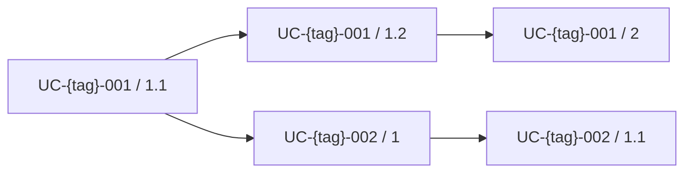

# Tasks: {Feature Name}

**Spec:** [{spec-id}](./spec.md)
**Created:** {YYYY-MM-DD}

---

## Overview

{2-3 sentences describing what this feature delivers end-to-end.}

**Strategic Alignment:** {How this feature supports the product mission/roadmap.}

**Success Criteria:**

| Criterion | Target |
|-----------|--------|
| {criterion 1} | {target} |
| {criterion 2} | {target} |

**Estimated Total Effort:** {N} story points

**Key Risks:**

| Risk | Impact | Mitigation |
|------|--------|------------|
| {risk} | {impact} | {mitigation} |

---

## [ ] UC-{tag}-001. {Use case title} ({brief description})

{1-2 sentences describing this use case slice — what it delivers and why it matters.}

- [ ] 1. {Task title}
  - Complexity: {1/2/3/5/8}
  - Dependencies: {task IDs or "None"}
  - Acceptance: {one-line acceptance criterion}
  - [ ] 1.1 {Subtask title}
    - Complexity: {1/2/3/5/8}
    - Dependencies: {task IDs}
    - Acceptance: {one-line acceptance criterion}
  - [ ] 1.2 {Subtask title}
    - Complexity: {1/2/3/5/8}
    - Dependencies: {task IDs}
    - Acceptance: {one-line acceptance criterion}

- [ ] 2. {Task title — tests for this slice}
  - Complexity: {1/2/3/5/8}
  - Dependencies: {task IDs of what's being tested}
  - Acceptance: {test acceptance criterion}

## [ ] UC-{tag}-002. {Use case title} ({brief description})

{1-2 sentences describing this use case slice.}

- [ ] 1. {Task title}
  - Complexity: {1/2/3/5/8}
  - Dependencies: {task IDs or "None"}
  - Acceptance: {one-line acceptance criterion}
  - [ ] 1.1 {Subtask title}
    - Complexity: {1/2/3/5/8}
    - Dependencies: {task IDs}
    - Acceptance: {one-line acceptance criterion}

---

## Execution Strategy

### Recommended Approach

{Description of how to implement these tasks — which to start with, what can be parallelized.}

### Critical Path

### Parallel Opportunities

- {Tasks X.Y and Z.W can be developed in parallel because they have no shared dependencies}

---

**Notes:**

- Tasks are organized as vertical slices through all layers (database, API, UI)
- Each feature section maps to a use case from requirements.md
- Complexity uses story points (1/2/3/5/8) — not time estimates
- When a task is completed, mark its checkbox and add:
  - `Completed: {YYYY-MM-DD}`
  - `Notes: {brief implementation notes, decisions, files created/modified}`
