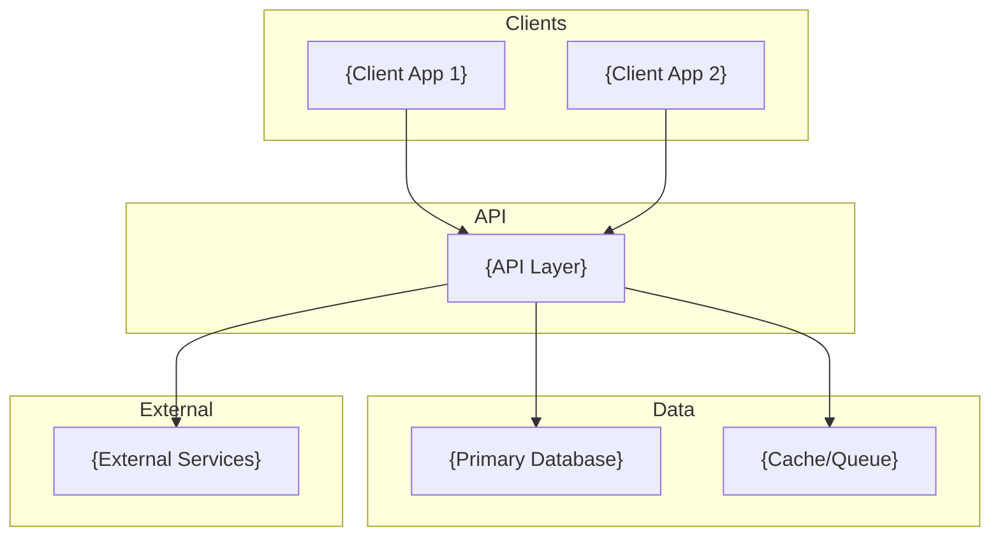

# {Product Name} Technology Stack

## Overview

{One paragraph describing the technology philosophy and why this stack was chosen.}

## Architecture



## Backend

### Language and Framework

| Component | Technology | Version | Purpose |
|-----------|------------|---------|---------|
| Language | {language} | {version} | {why chosen} |
| API | {protocol} | - | {why chosen} |
| Database | {database} | {version} | {why chosen} |
| Migrations | {tool} | {version} | {purpose} |

### Key Dependencies

```
{list key backend dependencies with comments}
```

## Frontend

### Framework and Build

| Component | Technology | Version | Purpose |
|-----------|------------|---------|---------|
| Framework | {framework} | {version} | {why chosen} |
| Language | {language} | {version} | {why chosen} |
| Build Tool | {tool} | {version} | {why chosen} |

### UI and Styling

| Component | Technology | Purpose |
|-----------|------------|---------|
| Styling | {tool} | {why chosen} |
| Component Library | {library} | {why chosen} |

### State and Data

| Component | Technology | Purpose |
|-----------|------------|---------|
| Server State | {tool} | {why chosen} |
| Client State | {tool} | {why chosen} |
| Forms | {tool} | {why chosen} |
| Validation | {tool} | {why chosen} |

### Testing

| Component | Technology | Purpose |
|-----------|------------|---------|
| Unit/Integration | {tool} | {why chosen} |
| Component Testing | {tool} | {why chosen} |
| E2E | {tool} | {why chosen} |

### Code Quality

| Component | Technology | Purpose |
|-----------|------------|---------|
| Linting/Formatting | {tool} | {why chosen} |

## Infrastructure

### Development

| Component | Technology | Purpose |
|-----------|------------|---------|
| Package Manager | {tool} | {why chosen} |
| Containerization | {tool} | {why chosen} |
| Task Runner | {tool} | {why chosen} |

### Production

| Component | Technology | Purpose |
|-----------|------------|---------|
| Hosting | {platform} | {why chosen} |
| Database | {service} | {why chosen} |
| CDN | {service} | {why chosen} |
| Monitoring | {service} | {why chosen} |

## Project Structure

```
{project}/
├── {dir}/                 # {description}
│   ├── {subdir}/          # {description}
│   └── {subdir}/          # {description}
├── {dir}/                 # {description}
└── {dir}/                 # {description}
```

## Development Commands

### {Subsystem 1}

```bash
{command}      # {description}
{command}      # {description}
```

### {Subsystem 2}

```bash
{command}      # {description}
{command}      # {description}
```

## Environment Variables

### {Subsystem}

```bash
# {Category}
{VAR}={description}
```

## Standards and Conventions

### Code Style

- **{Language}**: {convention}
- **{Language}**: {convention}

### API Design

- {convention}
- {convention}

### Database

- {convention}
- {convention}

### Testing

- {convention}
- {convention}
