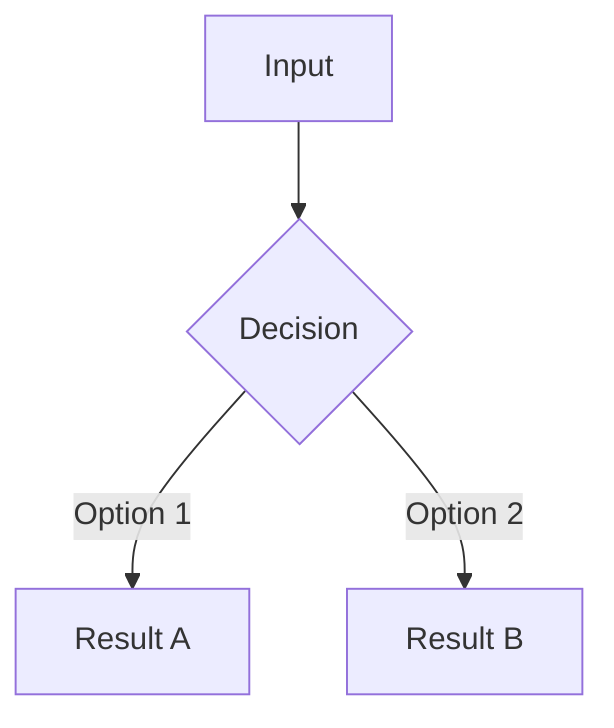

# Response Templates

Complete template examples for simple, detailed, and deep research responses.

## Simple Response Template

### Template Structure

```markdown
# [Concise, Specific Title]

[Direct answer to the question in 1-3 paragraphs. Include code examples inline if applicable.]

[Optional: Additional context or important notes]

## Sources
- [URL 1] - [Brief description]
- [URL 2] - [Brief description]
- [URL 3] - [Brief description]
```

### Complete Example: Git Amend

```markdown
# How to Amend a Git Commit

Use `git commit --amend` to modify the most recent commit. This command opens your editor to change the commit message and includes any currently staged changes in the amended commit.

If you don't want to edit the commit message, use:
```bash
git commit --amend --no-edit
```

**Important:** Only amend commits that haven't been pushed to a shared branch, as amending rewrites commit history.

## Sources
- https://git-scm.com/docs/git-commit - Official git commit documentation
- https://github.com/git-guides/git-commit - GitHub's git commit guide
```

### Complete Example: Python List Comprehension

```markdown
# How to Use Python List Comprehensions

List comprehensions provide a concise way to create lists in Python. The basic syntax is:
```python
[expression for item in iterable if condition]
```

Example - create a list of squares for even numbers:
```python
squares = [x**2 for x in range(10) if x % 2 == 0]
# Result: [0, 4, 16, 36, 64]
```

List comprehensions are generally faster and more readable than equivalent for-loops for simple transformations.

## Sources
- https://docs.python.org/3/tutorial/datastructures.html - Python list comprehensions tutorial
- https://peps.python.org/pep-0202/ - List comprehensions PEP
```

## Detailed Response Template

### Template Structure

```markdown
# [Descriptive Title]

[Executive summary: 2-3 sentences providing high-level overview of the topic and what the reader will learn]

## Overview
[Context and background information. Why is this topic important? What problem does it solve? How does it fit into the broader ecosystem?]

## [Major Topic 1]
[Detailed explanation of the first major aspect. Include examples, code samples, or specific details.]

### [Subtopic 1.1]
[If needed, break down complex topics into subsections]

### [Subtopic 1.2]
[Additional details]

## [Major Topic 2]
[Second major aspect with similar level of detail]

## [Major Topic 3]
[Third major aspect - adjust number of sections based on topic complexity]

## Key Takeaways
- [Most important point to remember]
- [Second critical insight]
- [Third essential concept]
- [Fourth key practice or recommendation]
- [Fifth summary point if applicable]

## Sources
- [URL 1] - [Description of information from this source]
- [URL 2] - [Description]
- [URL 3] - [Description]
- [URL 4] - [Description]
- [URL 5+] - [Description]
```

**Length:** 500-1500 words

**Tone:** Educational, organized

## Deep Research Document Template

For in-depth research produced by the `m:research` command. This template produces a long-form document with implementation guidance, code examples, and tiered source attribution.

### Template Structure

```markdown
---
date: YYYY-MM-DD
query: <original research input>
stack: <detected tech stack>
---

# Research: <Topic>

## Summary
{3-5 sentence answer — what this is, why it matters, what to use}

## Tech Stack Context
{Detected stack: e.g., "TypeScript + Next.js"}
{How the detected stack affects the recommendations, library choices, and code examples below}

## Key Findings
- [Tier 1] {Finding from official documentation with source}
- [Tier 1] {Another authoritative finding}
- [Tier 2] {Finding from secondary authoritative source}
- [Tier 3] {Community-sourced finding, verified}
{Continue as needed — aim for 5-10 findings}

## Library / Tool Comparison

| Name | What it does | Popularity | License | When to use |
|------|-------------|------------|---------|-------------|
| lib-a | Brief description | stars/downloads | MIT | Best for X |
| lib-b | Brief description | stars/downloads | Apache-2.0 | Best for Y |
| lib-c | Brief description | stars/downloads | MIT | Best for Z |

## How-To: Implementation Guide

Step-by-step instructions as if teaching someone from scratch. All code examples use the detected language/framework.

### Step 1: Install Dependencies

```bash
npm install lib-a
```

### Step 2: Configure

```typescript
// Example in detected language
import { configure } from 'lib-a';

configure({
  option: 'value',
});
```

### Step 3: Implement Core Logic

```typescript
// Implementation with inline comments explaining each decision
```

{Continue with as many steps as needed}

## Scenarios

| Scenario | Approach | Notes |
|----------|----------|-------|
| Basic case | Direct usage of X | Simplest path |
| Edge case: empty input | Guard clause before X | Common gotcha |
| Production | Add caching + error handling | Performance consideration |

## Diagrams



{Include architecture diagrams, sequence diagrams, or flow diagrams as applicable}

## Knowledge Gaps
- {What this research didn't cover}
- {Areas that need further investigation}
- {Where to look next}

## Sources

### Tier 1 — Authoritative Primary
- [URL] - [Description]

### Tier 2 — Authoritative Secondary
- [URL] - [Description]

### Tier 3 — Community
- [URL] - [Description]

### Tier 4 — Unverified
- [URL] - [Description and why it was included despite lower trust]
```

### Guidelines

- **Length**: 1000-3000+ words depending on topic depth
- **Code examples**: Always in the detected language/framework
- **Diagrams**: Include at least one Mermaid diagram when architecture or flow is involved
- **Source tiers**: Label every finding with its source tier
- **Knowledge gaps**: Always include — honest about what wasn't covered

## Template Selection Guide

| Query Type | Template | Indicators |
|------------|----------|------------|
| Specific how-to | Simple | "How do I...", single task, quick answer |
| Definition | Simple | "What is...", single concept |
| Command reference | Simple | Syntax lookup, parameter info |
| Quick example | Simple | "Show me how to..." |
| Overview | Detailed | "Research all...", "Give me an intro" |
| Multiple concepts | Detailed | Several related topics |
| Comparison | Detailed | "Compare X and Y" |
| Best practices guide | Detailed | "Best practices for..." |
| Deep dive | Deep Research | "Research how to implement...", "Deep dive into..." |
| Implementation guide | Deep Research | "How should we build...", "What's the best approach to..." |
| Architecture decision | Deep Research | "Compare approaches for...", "What stack should we use for..." |
