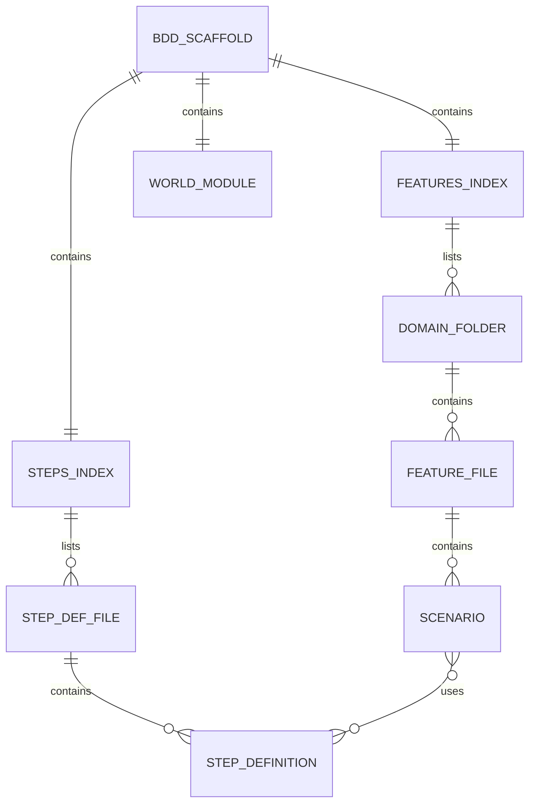
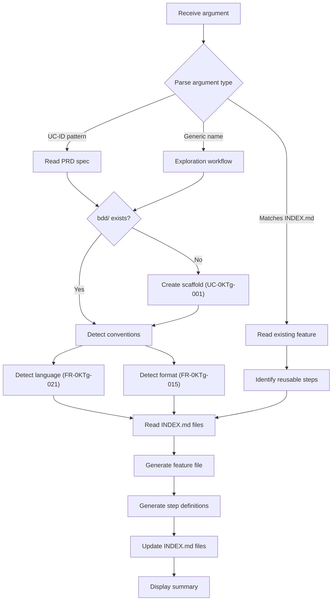
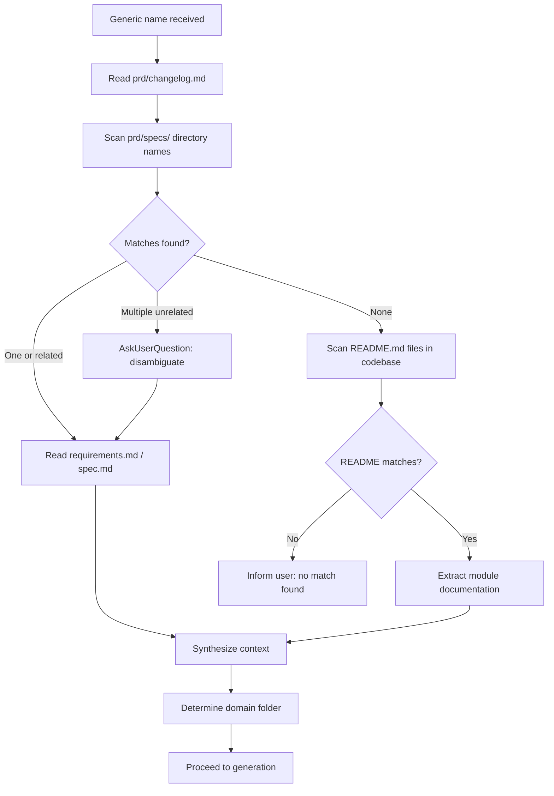

# Specification: BDD Scenario Generator

**Spec ID:** 20260223-1600-bdd_scenario_generator
**Status:** Draft
**Created:** 2026-02-23
**Last Updated:** 2026-02-23

---

## 1. Overview

### 1.1 Feature Description

The BDD Scenario Generator is a Molcajete command (`/m:stories`) implemented as a single Markdown skill file. When invoked, it generates Gherkin `.feature` or `.feature.md` files and corresponding step definitions in the project's `bdd/` directory. The skill is self-contained: all templates, decision logic, and rules are embedded in the skill file itself.

The skill operates through a multi-phase pipeline: (1) parse the argument to determine intent, (2) detect project conventions (language, format), (3) gather context from PRD specs and codebase, (4) generate feature files and step definitions, (5) update index files, (6) display a summary. Each phase has explicit rules and fallback behavior documented in this spec.

The key technical challenge is that this is not a code-executed program — it is a prompt that instructs an LLM to perform file operations. All "algorithms" described here are prompt instructions that the LLM follows. The skill file must be precise enough that the LLM produces consistent, correct output across invocations.

For detailed requirements, see [requirements.md](./requirements.md).

### 1.2 Strategic Alignment

| Aspect | Alignment |
|--------|-----------|
| Mission | Extends Molcajete's structured workflow to testing — executable specifications generated with the same consistency as other Molcajete artifacts |
| Roadmap | Implements the "BDD Self-Testing" priority; provides the authoring tool for the self-testing framework |
| Success Metrics | Single-command scenario generation; step reuse rate >= 30%; zero Gherkin syntax errors |

### 1.3 User Value

| User Type | Value Delivered |
|-----------|-----------------|
| Developer | Generate BDD scenarios with a single `/m:stories` command — correct folder placement, step reuse, index updates |
| AI Agent | Autonomously author BDD suites by reading INDEX.md for orientation, then invoking the skill |
| QA / Reviewer | Browse `bdd/features/INDEX.md` for a complete catalog of specified behaviors by domain |

### 1.4 Success Criteria

| Criterion | Target | Measurement |
|-----------|--------|-------------|
| Gherkin validity | Zero parse errors in generated files | Run Gherkin linter on all generated `.feature` / `.feature.md` files |
| Step reuse | >= 30% of steps reuse existing definitions | Count reused vs. new in generation summary |
| Index consistency | INDEX.md always matches file system | Diff index entries against actual files |
| Single-pass | Scenario generated on first invocation | No follow-up commands needed |

---

## 2. Requirements Summary

### 2.1 Functional Requirements

| ID | Requirement | Priority |
|----|-------------|----------|
| FR-0KTg-001 | BDD scaffold at repository root `bdd/` | Critical |
| FR-0KTg-002 | Features organized by business domain under `bdd/features/` | Critical |
| FR-0KTg-003 | Domain folders auto-detected from codebase, PRD, changelog | High |
| FR-0KTg-005 | `bdd/features/INDEX.md` master index | Critical |
| FR-0KTg-006 | `bdd/steps/INDEX.md` master index | Critical |
| FR-0KTg-010 | Argument accepts UC-ID, feature name, or generic description | Critical |
| FR-0KTg-015 | Auto-detect `.feature` vs `.feature.md` format | Critical |
| FR-0KTg-015a | Never mix formats in `bdd/features/` | Critical |
| FR-0KTg-021 | Auto-detect step definition language from `bdd/steps/` | Critical |
| FR-0KTg-026 | Never mix languages in `bdd/steps/` | Critical |
| FR-0KTg-032 | Implemented as a Molcajete command file | Critical |
| FR-0KTg-033 | Self-contained — all templates and rules in one file | Critical |
| FR-0KTg-038 | Generic names trigger codebase exploration | Critical |
| FR-0KTg-044 | Exploration results produce implementation-specific scenarios | Critical |
| FR-0KTg-046 | Full Gherkin: Scenario Outlines, Examples, Background, data tables | Critical |
| FR-0KTg-058 | Skill owns everything inside `bdd/` | Critical |

### 2.2 Non-Functional Requirements

| ID | Requirement | Target |
|----|-------------|--------|
| NFR-0KTg-001 | Single-pass execution | No follow-up commands |
| NFR-0KTg-002 | INDEX.md readable in one context window | Under 500 lines |
| NFR-0KTg-003 | Valid Gherkin syntax | Zero parse errors |
| NFR-0KTg-004 | Self-contained skill file | No external reads beyond `bdd/` and `prd/` |
| NFR-0KTg-005 | Render correctly as Markdown | GitHub, VS Code, standard viewers |
| NFR-0KTg-006 | No production credentials in step definitions | Security |

### 2.3 Constraints

| Constraint | Description |
|------------|-------------|
| Skill file format | Must be a single `.md` file with YAML frontmatter, following Molcajete command conventions |
| Execution context | Runs inside Claude Code — all file operations via Claude Code tools (Read, Write, Glob, Grep, Bash) |
| No runtime dependencies | The skill file is a prompt, not executable code. All "logic" is LLM instruction |
| Tool access | Needs `Read(*)`, `Write(*)`, `Edit(*)`, `Glob(*)`, `Grep(*)`, `Bash(*)`, `Task(*)`, `AskUserQuestion` |

### 2.4 Out of Scope

| Feature | Rationale |
|---------|-----------|
| Test runner configuration | Each project handles its own framework setup |
| CI/CD integration | Separate feature |
| Test execution or debugging | This skill generates files only |
| Browser E2E infrastructure | Separate feature |

---

## 3. BDD Directory Structure

### 3.1 Scaffold Layout

The skill creates and maintains this directory structure at the repository root:

```
bdd/
├── features/
│   ├── INDEX.md                          # Master feature index
│   ├── {domain}/                         # Auto-detected domain folders
│   │   ├── {feature-name}.feature        # Feature file (or .feature.md)
│   │   └── {feature-name}/              # Promoted feature directory (when >15 scenarios)
│   │       ├── {grouping}.feature
│   │       └── {grouping}.feature
│   └── cross-domain/                     # Features spanning multiple domains
├── steps/
│   ├── INDEX.md                          # Master step definition index
│   ├── world.[ext]                       # Test context and lifecycle hooks
│   ├── common_steps.[ext]                # Shared steps (Given/Then)
│   ├── api_steps.[ext]                   # HTTP/API interaction steps
│   ├── db_steps.[ext]                    # Database assertion steps
│   └── {domain}_steps.[ext]              # Domain-specific steps
└── .claude/                              # Optional: user-defined BDD rules
    └── rules/
        └── *.md
```

### 3.2 Index File Structures

#### Features INDEX.md

```markdown
# BDD Features Index

## {Domain Name}

### {Feature Name}
- **File:** `{domain}/{feature-name}.feature`
- **Summary:** {1-sentence description}
- **Scenarios:**
  - {Scenario name} — {brief description}
  - {Scenario name} — {brief description}
```

#### Steps INDEX.md

```markdown
# BDD Step Definitions Index

## Common Steps

| Pattern | Description | Parameters | Source |
|---------|-------------|------------|--------|
| `{step pattern}` | {description} | `{name}`: {type} | `common_steps.{ext}` |

## API Steps

| Pattern | Description | Parameters | Source |
|---------|-------------|------------|--------|
| `{step pattern}` | {description} | `{name}`: {type} | `api_steps.{ext}` |

## {Domain} Steps

| Pattern | Description | Parameters | Source |
|---------|-------------|------------|--------|
| `{step pattern}` | {description} | `{name}`: {type} | `{domain}_steps.{ext}` |
```

### 3.3 Entity Relationships



---

## 4. Skill Invocation Interface

### 4.1 Command Signature

```yaml
---
description: Generate BDD scenarios and step definitions for a feature
model: opus
allowed-tools:
  - Read(*)
  - Write(*)
  - Edit(*)
  - Glob(*)
  - Grep(*)
  - Bash(*)
  - Task(*)
  - AskUserQuestion
---
```

**Invocation:** `/m:stories <argument>`

**Argument types:**

| Type | Pattern | Example | Behavior |
|------|---------|---------|----------|
| Use case ID | `UC-XXXX-NNN` | `UC-0KTg-001` | Direct spec lookup in `prd/specs/` |
| Feature name | Matches entry in `bdd/features/INDEX.md` | `user-authentication` | Add scenarios to existing feature |
| Generic name | Anything else | `user authentication` | Codebase exploration workflow |

### 4.2 Execution Pipeline



### 4.3 Argument Parsing Algorithm

The skill determines intent by evaluating the argument in this order:

```
1. IF argument matches regex /^UC-[A-Za-z0-9]{4}-\d{3}$/
   THEN → Use Case ID path
   ACTION: Search prd/specs/*/requirements.md for matching UC-ID
   FALLBACK: If UC-ID not found, warn user, offer to treat as generic name

2. ELSE IF argument (kebab-cased) matches an entry in bdd/features/INDEX.md
   THEN → Existing Feature path
   ACTION: Read existing feature file, prepare to append scenarios

3. ELSE
   THEN → Generic Name path
   ACTION: Trigger exploration workflow (Section 4.5)
```

### 4.4 Convention Detection Algorithms

#### Language Detection (FR-0KTg-021 through FR-0KTg-026)

```
1. Glob bdd/steps/*.*
2. Count file extensions: .py, .go, .ts
3. IF no files exist → default to Python
4. IF one language detected → use that language
5. IF multiple languages → use majority language, warn user
6. NEVER create files in a different language than detected
```

**Language-to-framework mapping:**

| Extension | Language | Framework | Step Decorator/Registration |
|-----------|----------|-----------|----------------------------|
| `.py` | Python | behave or pytest-bdd | `@given`, `@when`, `@then` decorators |
| `.go` | Go | godog | `ctx.Step` registration in `InitializeScenario` |
| `.ts` | TypeScript | playwright-bdd or cucumber-js | `Given`, `When`, `Then` from framework import |

#### Format Detection (FR-0KTg-015 through FR-0KTg-015d)

```
1. Glob bdd/features/**/*.feature.md
2. Glob bdd/features/**/*.feature
3. IF .feature.md files exist → use .feature.md (MDG format)
4. ELSE IF .feature files exist → use .feature (standard Gherkin)
5. ELSE → default to .feature (standard Gherkin)
6. NEVER mix formats in bdd/features/
```

### 4.5 Exploration Workflow (UC-0KTg-005)

When the argument is a generic name, the skill gathers context before generating scenarios:



**Exploration source priority (FR-0KTg-045):**

| Priority | Source | What to Extract |
|----------|--------|-----------------|
| 1 | `prd/changelog.md` | Built features, domain organization, requirement ID mappings |
| 2 | `prd/specs/` directory names + `requirements.md` / `spec.md` | Use cases, actors, data models, validation rules, edge cases |
| 3 | `README.md` files in codebase directories | Module structure, relationships, domain rules |
| 4 | Source code scanning | Last resort — function signatures, type definitions, route handlers |

### 4.6 Domain Detection (FR-0KTg-054 through FR-0KTg-057)

```
1. IF bdd/.claude/rules/*.md exists → read domain mappings from rules
2. ELSE IF bdd/CLAUDE.md exists → read domain conventions
3. ELSE → infer from:
   a. Existing domain folders in bdd/features/
   b. Changelog domain sections
   c. PRD spec folder slugs
   d. Codebase directory structure
4. IF domain unclear → create new domain folder with descriptive name
5. cross-domain/ for features spanning multiple domains
```

---

## 5. File Generation Templates

### 5.1 Feature File — Standard Gherkin (`.feature`)

```gherkin
@{domain} @{priority-tag}
Feature: {Feature Name}
  {1-2 sentence description of the feature}

  Background:
    Given {shared precondition}

  @{scenario-tag}
  Scenario: {Scenario Name}
    Given {declarative system state}
    When {user action}
    Then {exact assertion}

  @{scenario-tag}
  Scenario Outline: {Parameterized Scenario Name}
    Given {state with <param>}
    When {action with <param>}
    Then {assertion with <expected>}

    Examples:
      | param   | expected |
      | value1  | result1  |
      | value2  | result2  |
```

### 5.2 Feature File — MDG Format (`.feature.md`)

````markdown
# Feature: {Feature Name}

{1-2 sentence description of the feature}

**Tags:** `@{domain}` `@{priority-tag}`

## Background

- **Given** {shared precondition}

## Scenario: {Scenario Name}

**Tags:** `@{scenario-tag}`

- **Given** {declarative system state}
- **When** {user action}
- **Then** {exact assertion}

## Scenario Outline: {Parameterized Scenario Name}

**Tags:** `@{scenario-tag}`

- **Given** {state with `<param>`}
- **When** {action with `<param>`}
- **Then** {assertion with `<expected>`}

### Examples

| param   | expected |
|---------|----------|
| value1  | result1  |
| value2  | result2  |
````

### 5.3 Step Definitions — Python (behave)

```python
"""
{Domain} step definitions.

Steps for {domain description} scenarios.
"""

from behave import given, when, then


@given("{step pattern with {param}}")
def step_given_description(context, param):
    """
    Set up {what this step does}.

    Args:
        param (str): {parameter description}
    """
    raise NotImplementedError("TODO: implement step")


@when("{step pattern with {param}}")
def step_when_description(context, param):
    """
    Perform {what this step does}.

    Args:
        param (str): {parameter description}
    """
    raise NotImplementedError("TODO: implement step")


@then("{step pattern with {param}}")
def step_then_description(context, param):
    """
    Assert {what this step verifies}.

    Args:
        param (str): {parameter description}
    """
    raise NotImplementedError("TODO: implement step")
```

### 5.4 Step Definitions — Go (godog)

```go
package steps

import (
	"context"
	"fmt"

	"github.com/cucumber/godog"
)

// {Domain}Steps registers step definitions for {domain} scenarios.
type {Domain}Steps struct {
	world *TestWorld
}

// New{Domain}Steps creates a new {domain} steps instance.
func New{Domain}Steps(world *TestWorld) *{Domain}Steps {
	return &{Domain}Steps{world: world}
}

// stepGivenDescription sets up {what this step does}.
//
// Parameters:
//   - param (string): {parameter description}
func (s *{Domain}Steps) stepGivenDescription(ctx context.Context, param string) error {
	return fmt.Errorf("TODO: implement step")
}

// stepWhenDescription performs {what this step does}.
//
// Parameters:
//   - param (string): {parameter description}
func (s *{Domain}Steps) stepWhenDescription(ctx context.Context, param string) error {
	return fmt.Errorf("TODO: implement step")
}

// stepThenDescription asserts {what this step verifies}.
//
// Parameters:
//   - param (string): {parameter description}
func (s *{Domain}Steps) stepThenDescription(ctx context.Context, param string) error {
	return fmt.Errorf("TODO: implement step")
}

// InitializeScenario registers all {domain} steps.
func (s *{Domain}Steps) InitializeScenario(ctx *godog.ScenarioContext) {
	ctx.Step(`^{step pattern with "([^"]*)"$`, s.stepGivenDescription)
	ctx.Step(`^{step pattern with "([^"]*)"$`, s.stepWhenDescription)
	ctx.Step(`^{step pattern with "([^"]*)"$`, s.stepThenDescription)
}
```

### 5.5 Step Definitions — TypeScript (cucumber-js)

```typescript
/**
 * {Domain} step definitions.
 *
 * Steps for {domain description} scenarios.
 */

import { Given, When, Then } from "@cucumber/cucumber";
import type { World } from "./world";

/**
 * Set up {what this step does}.
 *
 * @param param - {parameter description}
 */
Given("{step pattern with {param}}", async function (this: World, param: string) {
  throw new Error("TODO: implement step");
});

/**
 * Perform {what this step does}.
 *
 * @param param - {parameter description}
 */
When("{step pattern with {param}}", async function (this: World, param: string) {
  throw new Error("TODO: implement step");
});

/**
 * Assert {what this step verifies}.
 *
 * @param param - {parameter description}
 */
Then("{step pattern with {param}}", async function (this: World, param: string) {
  throw new Error("TODO: implement step");
});
```

### 5.6 World/Context Module Templates

#### Python (behave)

**`bdd/steps/world.py`:**

```python
"""
Test world — shared context for all BDD steps.

This module provides the test context object and lifecycle utilities.
Modify this file to add project-specific setup (DB connections, API clients, auth helpers).
"""


class World:
    """Shared test context passed between steps via behave's `context`."""

    def __init__(self):
        self.base_url = ""       # TODO: set API base URL
        self.db_conn = None      # TODO: set DB connection
        self.auth_token = None   # TODO: set auth token helper
        self.response = None     # Last HTTP response
        self.data = {}           # Arbitrary shared data between steps
```

**`bdd/steps/environment.py`:**

```python
"""
Behave environment hooks.

Lifecycle hooks for scenario setup and teardown.
"""

from steps.world import World


def before_scenario(context, scenario):
    """Initialize a fresh World for each scenario."""
    context.world = World()


def after_scenario(context, scenario):
    """Clean up after each scenario."""
    if context.world.db_conn:
        # TODO: TRUNCATE test tables or rollback transaction
        pass
```

#### Go (godog)

**`bdd/steps/world.go`:**

```go
package steps

import (
	"context"
	"net/http"
)

// TestWorld holds shared state between steps within a scenario.
// Modify this struct to add project-specific fields (DB pool, API client, auth helpers).
type TestWorld struct {
	BaseURL   string            // TODO: set API base URL
	AuthToken string            // TODO: set auth token helper
	Response  *http.Response    // Last HTTP response
	Data      map[string]any    // Arbitrary shared data between steps
}

// NewTestWorld creates a fresh TestWorld for a scenario.
func NewTestWorld() *TestWorld {
	return &TestWorld{
		Data: make(map[string]any),
	}
}

// BeforeScenario initializes the world before each scenario.
func BeforeScenario(ctx context.Context, sc *godog.Scenario) (context.Context, error) {
	world := NewTestWorld()
	return context.WithValue(ctx, worldKey, world), nil
}

// AfterScenario cleans up after each scenario.
func AfterScenario(ctx context.Context, sc *godog.Scenario, err error) (context.Context, error) {
	// TODO: TRUNCATE test tables or rollback transaction
	return ctx, nil
}

type contextKey string

const worldKey contextKey = "world"

// GetWorld retrieves the TestWorld from the context.
func GetWorld(ctx context.Context) *TestWorld {
	return ctx.Value(worldKey).(*TestWorld)
}
```

#### TypeScript (cucumber-js)

**`bdd/steps/world.ts`:**

```typescript
/**
 * Test world — shared context for all BDD steps.
 *
 * Modify this file to add project-specific setup (DB connections, API clients, auth helpers).
 */

import { World as CucumberWorld, setWorldConstructor, Before, After } from "@cucumber/cucumber";

export class World extends CucumberWorld {
  baseUrl = "";          // TODO: set API base URL
  authToken = "";        // TODO: set auth token helper
  response: Response | null = null;  // Last HTTP response
  data: Record<string, unknown> = {};  // Arbitrary shared data between steps
}

setWorldConstructor(World);

Before(async function (this: World) {
  // Initialize fresh state for each scenario
  this.data = {};
  this.response = null;
});

After(async function (this: World) {
  // TODO: TRUNCATE test tables or rollback transaction
});
```

---

## 6. Scenario Generation Rules

### 6.1 Gherkin Construct Selection (FR-0KTg-046 through FR-0KTg-049)

| Situation | Construct | Example |
|-----------|-----------|---------|
| Unique flow with specific setup and assertion | `Scenario` | Login with valid credentials |
| Same flow tested with different inputs/outputs | `Scenario Outline` + `Examples` | Login with various invalid credentials |
| Multiple scenarios sharing the same preconditions | `Background` | All scenarios need a logged-in user |
| Structured input data in a step | Data table in step | Creating a user with multiple fields |

### 6.2 Step Writing Rules

| Rule | Requirement ID | Example |
|------|----------------|---------|
| Given steps: declarative state, not procedural actions | FR-0KTg-018 | "Given user alice is logged in" not "Given I open the login page and type..." |
| Then steps: exact assertions, not approximations | FR-0KTg-019 | "Then balance is exactly $94.00" not "Then balance is around $94" |
| Every scenario has at least one tag | FR-0KTg-017 | `@smoke`, `@regression`, `@critical`, `@backend`, `@fullstack`, or domain tag |
| Step definitions include docstrings | FR-0KTg-020 | Every step function has a docstring with parameter descriptions |
| Step reuse: check INDEX.md before creating | FR-0KTg-012 | Read `bdd/steps/INDEX.md`, reuse matching patterns |

### 6.3 Feature File Splitting (FR-0KTg-050 through FR-0KTg-053)

```
1. Count scenarios in the target feature file
2. IF count + new scenarios > 15
   THEN → promote to directory
   a. Create bdd/features/{domain}/{feature-name}/ directory
   b. Group existing + new scenarios by logical concern
   c. Create separate .feature files per group with descriptive names
   d. Delete the original single feature file
   e. Update bdd/features/INDEX.md to list per-file scenarios
3. File names describe the grouping:
   GOOD: login.feature, password-reset.feature, session-management.feature
   BAD: scenarios-1-to-7.feature, part1.feature
```

---

## 7. Integration Points

### 7.1 Internal Dependencies

| Component | Dependency | Purpose |
|-----------|-----------|---------|
| `/m:stories` command | `prd/changelog.md` | Primary discovery source for exploration workflow |
| `/m:stories` command | `prd/specs/*/requirements.md` | Use case and requirement extraction for UC-ID arguments |
| `/m:stories` command | `prd/specs/*/spec.md` | Data model and API context for informed scenario generation |
| `/m:stories` command | `README.md` files in codebase | Module documentation for generic name resolution |
| `/m:stories` command | `bdd/.claude/rules/*.md` | User-defined domain mappings and BDD conventions |
| `/m:stories` command | `bdd/CLAUDE.md` | Project-specific BDD overrides |

### 7.2 Tool Dependencies

| Tool | Usage |
|------|-------|
| `Read(*)` | Read INDEX.md, PRD specs, README files, existing features |
| `Write(*)` | Create feature files, step definitions, INDEX.md, world module |
| `Edit(*)` | Append scenarios to existing feature files, update INDEX.md |
| `Glob(*)` | Scan `bdd/steps/` for language detection, `bdd/features/` for format detection, `prd/specs/` for spec folders |
| `Grep(*)` | Search changelog and READMEs for argument-related content |
| `Task(*)` | Launch parallel exploration sub-agents for context gathering |
| `AskUserQuestion` | Disambiguate multiple matches, clarify empty arguments |

### 7.3 Configuration

| Setting | Value | Purpose |
|---------|-------|---------|
| Default language | Python (behave) | Used when no existing step files detected |
| Default format | `.feature` (standard Gherkin) | Used when no existing feature files detected |
| Max scenarios per file | 15 | Trigger for feature file splitting |
| Index max lines | 500 | NFR-0KTg-002 constraint |

---

## 8. Acceptance Criteria

### UC-0KTg-001: Initialize BDD Scaffold

- [ ] Running `/m:stories` on a project without `bdd/` creates the full scaffold
- [ ] Scaffold includes `bdd/features/INDEX.md`, `bdd/steps/INDEX.md`, and `bdd/steps/world.[ext]`
- [ ] Domain folders are created based on codebase analysis
- [ ] Default language is Python if no existing step files detected
- [ ] Default format is `.feature` if no existing feature files detected

### UC-0KTg-002: Generate Scenarios for a Feature

- [ ] `/m:stories user-registration` creates `bdd/features/{domain}/user-registration.feature`
- [ ] Feature file contains at least one tagged scenario with Given/When/Then
- [ ] Step definitions created for patterns not in INDEX.md
- [ ] Both INDEX.md files updated with new entries
- [ ] Summary displayed: files created, steps reused, steps created

### UC-0KTg-003: Add Scenario to Existing Feature

- [ ] `/m:stories add password reset to user-authentication` appends to existing file
- [ ] No duplicate scenarios created
- [ ] Only genuinely new step definitions created
- [ ] INDEX.md updated with new scenario entries

### UC-0KTg-004: Maintain Index Files

- [ ] INDEX.md files reflect actual file system contents after every operation
- [ ] Stale entries detected and removed
- [ ] Missing entries detected and added

### UC-0KTg-005: Resolve Generic Feature Name

- [ ] Generic name triggers exploration of changelog, specs, READMEs
- [ ] Generated scenarios reference actual implementation, not generic patterns
- [ ] Multiple ambiguous matches prompt user via AskUserQuestion
- [ ] No matches inform user and request clarification

### Edge Cases

| Scenario | Expected Behavior |
|----------|-------------------|
| Empty argument | AskUserQuestion: "What feature should I generate scenarios for?" |
| UC-ID not found in specs | Warn, offer to treat as generic name |
| `bdd/steps/` has mixed `.py` and `.go` files | Warn, use majority language |
| Feature file would exceed 15 scenarios | Promote to directory with logical groupings |
| INDEX.md exists but is out of sync | Rebuild index from file system before proceeding |
| `bdd/.claude/rules/` has domain mappings | Follow user-defined mappings for placement |
| Exact duplicate scenario name | Inform user of existing location, skip creation |

### Performance Criteria

| Metric | Target |
|--------|--------|
| INDEX.md scan | Fits in a single LLM context read (< 500 lines) |
| Scaffold creation | All directories and files in a single invocation |
| Scenario generation | Complete feature + steps + index update in one pass |

### Security Criteria

| Requirement | Implementation |
|-------------|----------------|
| No production credentials | Step definitions use placeholder values and ENV vars |
| No production DB references | World module uses test-specific configuration |
| ENV=test guard | World/context lifecycle hooks enforce test environment |

---

## 9. Verification

### Unit Tests

| Test | Validates |
|------|-----------|
| Argument parser correctly identifies UC-ID pattern | UC-ID regex matches `UC-0KTg-001`, rejects `UC-short-1` |
| Argument parser correctly identifies existing feature name | Matches kebab-cased name against INDEX.md entries |
| Language detection selects correct language from file extensions | `.py` → Python, `.go` → Go, `.ts` → TypeScript, empty → Python |
| Format detection selects correct format from existing files | `.feature.md` present → MDG, `.feature` present → standard, empty → standard |
| Feature file splitting triggers at correct threshold | 16th scenario triggers promotion to directory |

### Integration Tests

| Test | Validates |
|------|-----------|
| Scaffold creation produces complete directory structure | All required directories, INDEX.md files, and world module exist |
| Scenario generation from UC-ID reads correct spec | UC-ID maps to correct `prd/specs/` folder |
| Step reuse works via INDEX.md lookup | Existing step pattern not re-created, only new patterns added |
| INDEX.md update is atomic with file creation | No partial index states after generation |
| Exploration workflow finds relevant specs and READMEs | Generic name resolves to correct codebase modules |

### E2E Tests

| Test | Validates |
|------|-----------|
| First-time `/m:stories user-registration` creates scaffold + feature + steps + indexes | Full Flow 1 from requirements |
| `/m:stories UC-XXXX-001` generates scenarios informed by PRD spec | Full Flow 2 from requirements |
| `/m:stories add X to Y` appends without duplicating | Full Flow 3 from requirements |
| `/m:stories notifications` with multiple matches prompts disambiguation | Full Flow 5 from requirements |
| Generated `.feature` files parse with Gherkin linter | NFR-0KTg-003 compliance |

---

## 10. Implementation Checklist

### Skill File (`molcajete/commands/stories.md`)

- [ ] YAML frontmatter with description, model, allowed-tools
- [ ] Argument parsing instructions (UC-ID, feature name, generic)
- [ ] Scaffold creation instructions (directory structure, INDEX.md, world module)
- [ ] Convention detection instructions (language, format)
- [ ] Exploration workflow instructions (changelog, specs, READMEs, disambiguation)
- [ ] Domain detection instructions (rules files, CLAUDE.md, inference)
- [ ] Feature file generation instructions with Gherkin rules
- [ ] Standard Gherkin `.feature` template embedded
- [ ] MDG `.feature.md` template embedded
- [ ] Step definition template — Python (behave)
- [ ] Step definition template — Go (godog)
- [ ] Step definition template — TypeScript (cucumber-js)
- [ ] World module template — Python (environment.py + world.py)
- [ ] World module template — Go (world.go)
- [ ] World module template — TypeScript (world.ts)
- [ ] Features INDEX.md template
- [ ] Steps INDEX.md template
- [ ] Index update instructions (add entries, detect drift, rebuild)
- [ ] Feature splitting instructions (threshold, promotion, naming)
- [ ] Step reuse instructions (read INDEX.md, match patterns, skip duplicates)
- [ ] Duplicate scenario detection instructions
- [ ] Summary output format
- [ ] Error handling for each error state

### Plugin Registration

- [ ] Add `stories.md` to `molcajete/commands/`
- [ ] Update `molcajete/.claude-plugin/plugin.json` to register `/m:stories` command

### Documentation

- [ ] Update `prd/roadmap.md` with spec link
- [ ] Update `prd/README.md` feature table with spec link

---

## Appendix

### Related Documents

| Document | Location |
|----------|----------|
| Requirements | [requirements.md](./requirements.md) |
| Tasks | [tasks.md](./tasks.md) |
| Mission | [../../mission.md](../../mission.md) |
| Tech Stack | [../../tech-stack.md](../../tech-stack.md) |
| Roadmap | [../../roadmap.md](../../roadmap.md) |
