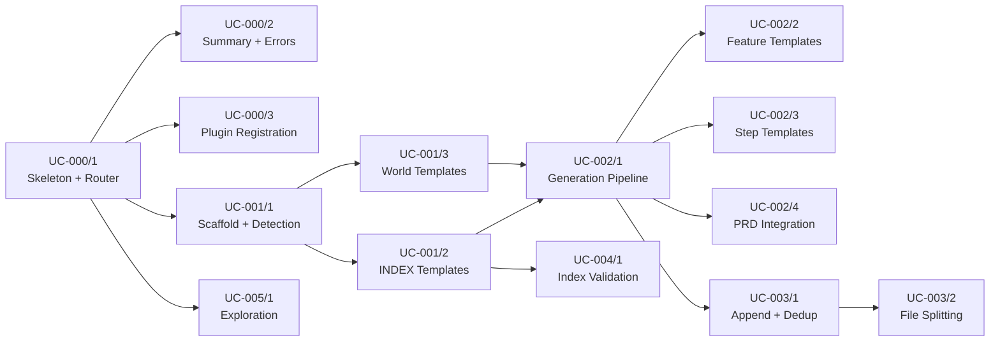

# Tasks: BDD Scenario Generator

**Spec:** [20260223-1600-bdd_scenario_generator](./spec.md)
**Created:** 2026-02-23

---

## Overview

Deliver the `/m:stories` command — a single Markdown skill file (`molcajete/commands/stories.md`) that generates Gherkin BDD scenarios, step definitions, and index files in any project's `bdd/` directory. The command handles scaffold creation, convention detection, context gathering from PRD specs and codebase, and file generation with support for multiple languages and formats.

**Strategic Alignment:** Implements the "BDD Self-Testing" priority on the roadmap. This is the authoring tool that enables Molcajete to self-test its own commands and skills through executable specifications.

**Success Criteria:**

| Criterion | Target |
|-----------|--------|
| Gherkin validity | Zero parse errors in generated files |
| Step reuse | >= 30% of steps reuse existing definitions |
| Index consistency | INDEX.md matches file system after every invocation |
| Single-pass execution | Scenario generated without follow-up commands |

**Estimated Total Effort:** 34 story points

**Key Risks:**

| Risk | Impact | Mitigation |
|------|--------|------------|
| Single file becomes too large for LLM context | Command may be truncated or misread | Keep templates concise; use minimal-but-complete examples |
| LLM inconsistency across invocations | Generated output varies despite same instructions | Use explicit rules with examples, not vague guidance |
| Template correctness for all 3 languages | Generated step defs may have syntax errors | Include verified, minimal templates for each language |

---

## [x] UC-0KTg-000. Shared Prerequisites

These tasks create the command file skeleton and argument parsing logic needed by all subsequent use cases. They exist here because the frontmatter, argument router, error handling, and summary output are shared infrastructure that cannot belong to a single UC without creating circular dependencies.

- [x] 1. Create command file skeleton with YAML frontmatter and argument router
  - Complexity: 3
  - Dependencies: None
  - Acceptance: `molcajete/commands/stories.md` exists with valid YAML frontmatter (description, model: opus, allowed-tools, argument-hint) and the argument parsing algorithm from spec section 4.3 (UC-ID regex, INDEX.md match, generic name fallback)
  - Unblocks: UC-0KTg-001, UC-0KTg-002, UC-0KTg-003, UC-0KTg-004, UC-0KTg-005
  - Completed: 2026-02-23
  - Notes: Created `molcajete/commands/stories.md` with frontmatter (model: claude-opus-4-6, matching existing convention) and three-branch argument router (UC-ID regex, INDEX.md match, generic name fallback) with empty argument handling via AskUserQuestion
  - [x] 1.1 Write YAML frontmatter and command title/role description
    - Complexity: 1
    - Dependencies: None
    - Acceptance: Frontmatter includes description, model, allowed-tools list matching spec section 4.1, and argument-hint
    - Completed: 2026-02-23
    - Notes: Frontmatter uses comma-separated allowed-tools format matching existing commands; model set to `claude-opus-4-6` per project convention
  - [x] 1.2 Write argument parsing instructions with three-branch routing
    - Complexity: 2
    - Dependencies: UC-0KTg-000/1.1
    - Acceptance: Instructions cover UC-ID regex check, INDEX.md feature name match, and generic name fallback; includes error handling for empty arguments (AskUserQuestion)
    - Completed: 2026-02-23
    - Notes: Three-branch routing with steps 1a (empty), 1b (UC-ID), 1c (existing feature), 1d (generic name); each with clear fallback behavior

- [x] 2. Write summary output format and error handling framework
  - Complexity: 2
  - Dependencies: UC-0KTg-000/1
  - Acceptance: Summary template shows feature file location, action taken, steps reused, steps created, index files updated, and test run command; error states from spec section 8 edge cases are handled with clear messages
  - Unblocks: UC-0KTg-001, UC-0KTg-002, UC-0KTg-003, UC-0KTg-005
  - Completed: 2026-02-23
  - Notes: Summary uses markdown table format with language-specific test commands; error handling covers all 10 edge cases from spec section 8 in a reference table

- [x] 3. Register command in plugin manifest
  - Complexity: 1
  - Dependencies: UC-0KTg-000/1.1
  - Acceptance: `molcajete/.claude-plugin/plugin.json` includes `./commands/stories.md` in the commands array
  - Unblocks: None (can run in parallel with any other task after 1.1)
  - Completed: 2026-02-23
  - Notes: Added `./commands/stories.md` to commands array in alphabetical order (between spec.md and tasks.md)

---

## [x] UC-0KTg-001. Initialize BDD Scaffold (create bdd/ directory structure on first use)

When `/m:stories` is invoked on a project without a `bdd/` directory, the skill creates the full scaffold: domain folders, empty INDEX.md files, and a world/context module. This is the foundation all other use cases build on.

- [x] 1. Write scaffold creation instructions with directory layout and domain detection
  - Complexity: 3
  - Dependencies: UC-0KTg-000/1
  - Acceptance: Instructions create the scaffold layout from spec section 3.1; domain folders are auto-detected from codebase (FR-0KTg-003); checks for `bdd/.claude/rules/` and `bdd/CLAUDE.md` per FR-0KTg-054/055; includes `cross-domain/` folder
  - Completed: 2026-02-23
  - Notes: Step 2 added to stories.md with scaffold check (2a), directory creation (2b), domain detection with 6-priority algorithm (2c), language detection (2d), format detection (2e), and scaffold file creation note (2f)
  - [x] 1.1 Write directory creation instructions and domain detection logic
    - Complexity: 2
    - Dependencies: UC-0KTg-000/1
    - Acceptance: Creates `bdd/features/`, `bdd/steps/`, auto-detected domain subdirectories; reads changelog and codebase for domain inference per spec section 4.6
    - Completed: 2026-02-23
    - Notes: Added Step 2 (Ensure BDD Scaffold) with sections 2a-2d: scaffold check, base directory creation, 6-priority domain detection algorithm, placeholder note for step files
  - [x] 1.2 Write convention detection algorithms (language + format)
    - Complexity: 1
    - Dependencies: UC-0KTg-001/1.1
    - Acceptance: Language detection scans `bdd/steps/` extensions (FR-0KTg-021..026); format detection scans `bdd/features/` for `.feature.md` vs `.feature` (FR-0KTg-015..015d); defaults to Python + `.feature`
    - Completed: 2026-02-23
    - Notes: Added sections 2d (language detection with framework mapping table) and 2e (format detection); defaults to Python + .feature; mixed-language warning included; updated 2f to clarify scaffold-only file creation

- [x] 2. Embed INDEX.md templates for features and steps
  - Complexity: 2
  - Dependencies: UC-0KTg-001/1.1
  - Acceptance: Features INDEX.md template from spec section 3.2 embedded; Steps INDEX.md template embedded; both follow the exact format in the spec with domain grouping (FR-0KTg-027..031)
  - Completed: 2026-02-23
  - Notes: Added "INDEX.md Templates" reference section with both templates embedded as fenced code blocks; features grouped by domain, steps grouped by category (Common, API, Database, domain-specific); includes guidance for initial scaffold (headings only, no entries)

- [x] 3. Embed world/context module templates for all three languages
  - Complexity: 3
  - Dependencies: UC-0KTg-001/1.2
  - Acceptance: Python (environment.py + world.py), Go (world.go), TypeScript (world.ts) templates from spec section 5.6 embedded; includes lifecycle hooks, test context object, and project-specific placeholders (FR-0KTg-059..062); world module is NOT modified if it already exists (FR-0KTg-061)
  - Completed: 2026-02-23
  - Notes: Added "World/Context Module Templates" reference section with all three language templates; Go template includes godog import (fixed from spec omission); FR-0KTg-061 guard noted at top of section; Python has both world.py and environment.py

- [x] 4. Write scaffold auto-creation trigger
  - Complexity: 1
  - Dependencies: UC-0KTg-001/1, UC-0KTg-001/2, UC-0KTg-001/3
  - Acceptance: When `bdd/` does not exist, scaffold is auto-created before proceeding to scenario generation (FR-0KTg-009); integrates with the argument router from UC-0KTg-000/1
  - Completed: 2026-02-23
  - Notes: Updated Step 2 intro to explicitly state it runs on every invocation regardless of argument type; scaffold check (2a) provides instant skip when already set up

---

## [x] UC-0KTg-002. Generate Scenarios for a Feature (create feature files and step definitions)

The core scenario generation pipeline: given a resolved feature (from UC-ID or generic name), generate a Gherkin feature file in the correct domain folder, create step definitions for new patterns, and update both INDEX.md files.

- [x] 1. Write scenario generation pipeline instructions
  - Complexity: 5
  - Dependencies: UC-0KTg-001/1.2, UC-0KTg-001/2
  - Acceptance: Instructions implement the full pipeline from spec section 4.2; reads INDEX.md files to check for existing features and reusable steps (FR-0KTg-011/012); determines domain folder placement; generates feature file with tagged scenarios using appropriate Gherkin constructs (FR-0KTg-046..049); creates step definitions for new patterns only; updates both INDEX.md files atomically (FR-0KTg-029)
  - Completed: 2026-02-23
  - Notes: Added Step 3 (Generate Scenarios) with four sections: 3a (domain folder placement), 3b (feature file generation rules), 3c (step definition generation with reuse), 3d (index updates)
  - [x] 1.1 Write feature file generation rules and Gherkin conventions
    - Complexity: 2
    - Dependencies: UC-0KTg-001/1.2
    - Acceptance: Instructions enforce: kebab-case file names (FR-0KTg-016), at least one tag per scenario (FR-0KTg-017), declarative Given steps (FR-0KTg-018), exact Then assertions (FR-0KTg-019), correct Gherkin construct selection per spec section 6.1
    - Completed: 2026-02-23
    - Notes: Added Step 3 (Generate Scenarios) to stories.md with sections 3a (domain folder placement) and 3b (feature file generation rules); includes tag table, step writing rules with good/bad examples, and Gherkin construct selection table
  - [x] 1.2 Write step definition generation rules with reuse logic
    - Complexity: 2
    - Dependencies: UC-0KTg-001/2
    - Acceptance: Instructions read `bdd/steps/INDEX.md` before creating steps; reuse existing patterns; create new steps with docstrings and parameter descriptions (FR-0KTg-020); organize by domain in correct step file (FR-0KTg-007)
    - Completed: 2026-02-23
    - Notes: Added section 3c (Generate Step Definitions) with INDEX.md reuse check, step file placement table (common/api/db/domain), docstring requirements, and language consistency rules
  - [x] 1.3 Write index update instructions
    - Complexity: 1
    - Dependencies: UC-0KTg-001/2
    - Acceptance: Both INDEX.md files updated with new feature entries, scenario lists, and step definitions after every generation
    - Completed: 2026-02-23
    - Notes: Added section 3d (Update Index Files) with instructions for features INDEX.md (domain heading, feature entry) and steps INDEX.md (category heading, table row); enforces no partial index state per FR-0KTg-029

- [x] 2. Embed feature file templates (standard Gherkin + MDG)
  - Complexity: 2
  - Dependencies: UC-0KTg-002/1.1
  - Acceptance: Standard `.feature` template from spec section 5.1 embedded; MDG `.feature.md` template from spec section 5.2 embedded; skill selects correct template based on detected format convention
  - Completed: 2026-02-24
  - Notes: Added "Feature File Templates" reference section with both standard Gherkin and MDG templates; includes format selection guidance referencing Step 2e detection

- [x] 3. Embed step definition templates for all three languages
  - Complexity: 3
  - Dependencies: UC-0KTg-002/1.2
  - Acceptance: Python/behave template from spec section 5.3 embedded; Go/godog template from spec section 5.4 embedded; TypeScript/cucumber-js template from spec section 5.5 embedded; each includes docstrings with parameter descriptions; skill selects correct template based on detected language
  - Completed: 2026-02-24
  - Notes: Added "Step Definition Templates" reference section with all three language templates; includes guidance for new file vs. appending to existing

- [x] 4. Write PRD spec integration for UC-ID arguments
  - Complexity: 2
  - Dependencies: UC-0KTg-000/1.2, UC-0KTg-002/1
  - Acceptance: When argument matches UC-ID pattern, skill reads the corresponding `prd/specs/*/requirements.md` and `spec.md` to inform scenario generation (FR-0KTg-014); scenarios reflect actual use case details, not generic patterns
  - Completed: 2026-02-24
  - Notes: Enhanced Step 1b with detailed spec extraction instructions (actors, flows, validation rules, edge cases); added Step 3 preamble requiring spec context to drive implementation-specific scenarios

---

## [x] UC-0KTg-003. Add Scenario to Existing Feature (append without duplicating)

When the argument matches an existing feature in INDEX.md, the skill appends new scenarios to the existing feature file without duplicating existing scenarios or step definitions.

- [x] 1. Write append and deduplication logic
  - Complexity: 3
  - Dependencies: UC-0KTg-002/1
  - Acceptance: Instructions read the existing feature file and INDEX.md to understand current scenarios; check for exact or near-duplicate scenario names before creating (FR-0KTg-013); inform user and skip on duplicate; only create genuinely new step definitions; update INDEX.md with new entries only
  - Completed: 2026-02-24
  - Notes: Added section 3-pre (Existing Feature: Read and Deduplicate) with exact match skip, near-duplicate detection (80% word overlap with AskUserQuestion), and context forwarding. Added append-to-file instructions in 3b and INDEX.md append-only update in 3d.
  - [x] 1.1 Write duplicate scenario detection
    - Complexity: 2
    - Dependencies: UC-0KTg-002/1
    - Acceptance: Skill checks INDEX.md for existing scenarios with similar names; exact or near-duplicate found → inform user of location and skip; user explicitly requests addition → append without duplicating
    - Completed: 2026-02-24
    - Notes: Added section 3-pre with three-tier check: exact match (case-insensitive) → skip with message; near-duplicate (80% word overlap after removing articles) → AskUserQuestion; no match → proceed. Context forwarded to 3b and 3c.
  - [x] 1.2 Write append-to-file instructions
    - Complexity: 1
    - Dependencies: UC-0KTg-003/1.1
    - Acceptance: New scenarios appended to the end of the existing feature file using Edit tool; existing content preserved; INDEX.md updated with new scenario entries
    - Completed: 2026-02-24
    - Notes: Added "Appending to an existing feature" subsection in 3b — Edit tool append, preserve existing content, inherit Background, match conventions. Updated 3d with existing feature branch for INDEX.md (append new scenario entries only).

- [x] 2. Write feature file splitting logic
  - Complexity: 3
  - Dependencies: UC-0KTg-003/1
  - Acceptance: When scenario count exceeds 15, feature file is promoted to a directory with logically-named sub-files (FR-0KTg-050..053); original file deleted; INDEX.md updated to reflect directory structure; file names describe logical groupings, not numeric ranges
  - Completed: 2026-02-24
  - Notes: Added section 3e (Feature File Splitting) with scenario count check, grouping heuristics (shared tags, user flows, Background setup), directory creation, sub-file creation with descriptive names, original file deletion, and INDEX.md directory entry format. Prohibited numeric/generic names.

---

## [x] UC-0KTg-004. Maintain Index Files (sync indexes with file system)

Ensure INDEX.md files stay synchronized with actual file contents. Detect and fix drift before proceeding with any operation.

- [x] 1. Write index validation and rebuild instructions
  - Complexity: 3
  - Dependencies: UC-0KTg-001/2
  - Acceptance: Before any generation operation, skill checks if INDEX.md matches file system; detects stale entries (files referenced but missing) and missing entries (files present but not indexed); rebuilds index from file system contents when drift is detected; both indexes validated (FR-0KTg-029)
  - Completed: 2026-02-24
  - Notes: Added sections 2g (Validate Index Files) and 2h (Rebuild Indexes from File System) to stories.md. Section 2a now routes to 2g instead of Step 3 when scaffold exists. Drift detection covers both features and steps indexes. Rebuild extracts data from actual files using language-aware parsing.
  - [x] 1.1 Write drift detection logic
    - Complexity: 2
    - Dependencies: UC-0KTg-001/2
    - Acceptance: Glob `bdd/features/` and `bdd/steps/` contents; compare against INDEX.md entries; report discrepancies
    - Completed: 2026-02-24
    - Notes: Added sections 2g (Validate Index Files) and 2h placeholder (Rebuild Indexes) to stories.md. Section 2g detects stale entries (in INDEX but not on disk) and missing entries (on disk but not in INDEX) for both features and steps indexes. Skips validation when scaffold was just created. Updated Step 2 intro to mention index validation.
  - [x] 1.2 Write index rebuild from file system
    - Complexity: 1
    - Dependencies: UC-0KTg-004/1.1
    - Acceptance: Read all feature files to extract scenario names and tags; read all step files to extract patterns and parameters; rebuild INDEX.md from scratch with correct grouping
    - Completed: 2026-02-24
    - Notes: Replaced 2h placeholder with full rebuild instructions. Features INDEX rebuild reads Feature name/description/scenarios, groups by domain, handles promoted directories. Steps INDEX rebuild extracts patterns/descriptions/parameters per language (Python/Go/TypeScript), categorizes by filename prefix. Reports stale entries removed and missing entries added.

---

## [x] UC-0KTg-005. Resolve Generic Feature Name (codebase exploration workflow)

When the argument is a generic name (not a UC-ID, not an existing feature), the skill explores the codebase to understand what the name means in this project, then generates scenarios based on actual implementation details.

- [x] 1. Write exploration workflow instructions
  - Complexity: 5
  - Dependencies: UC-0KTg-000/1.2, UC-0KTg-002/1
  - Acceptance: Instructions implement the exploration flowchart from spec section 4.5; follows source priority order (FR-0KTg-045): changelog, specs directory scan, README.md files, source code; exploration results used to generate implementation-specific scenarios (FR-0KTg-044)
  - Completed: 2026-02-24
  - Notes: Added Step 2-exp (Explore Codebase for Generic Name) between Step 2 and Step 3 in stories.md with five sub-sections (2-exp-a through 2-exp-e). Updated Step 1d to reference Step 2-exp. Added exploration context preamble to Step 3.
  - [x] 1.1 Write changelog and specs scanning
    - Complexity: 2
    - Dependencies: UC-0KTg-000/1.2
    - Acceptance: Read `prd/changelog.md` for domain-organized entries related to argument (FR-0KTg-039); scan `prd/specs/` directory names to find matching slugs (FR-0KTg-040); read matched `requirements.md`/`spec.md` for use cases, actors, data models (FR-0KTg-041)
    - Completed: 2026-02-24
    - Notes: Added sections 2-exp-a (Read Changelog with keyword matching and extraction) and 2-exp-b (Scan Specs Directory with slug matching and spec file reading)
  - [x] 1.2 Write README and codebase scanning
    - Complexity: 1
    - Dependencies: UC-0KTg-005/1.1
    - Acceptance: Scan for `README.md` files in directories related to the argument (FR-0KTg-042); extract module structure, relationships, domain rules; source code scanning as last resort
    - Completed: 2026-02-24
    - Notes: Added sections 2-exp-c (Scan README Files with path-based filtering and exclusions) and 2-exp-d (Source Code Scanning as last resort with Grep and top-10 limit)
  - [x] 1.3 Write disambiguation logic for ambiguous matches
    - Complexity: 2
    - Dependencies: UC-0KTg-005/1.1
    - Acceptance: When multiple unrelated features match, present options via AskUserQuestion (FR-0KTg-043); when no matches found, inform user and request clarification; selected match flows into generation pipeline
    - Completed: 2026-02-24
    - Notes: Added section 2-exp-e (Synthesize and Disambiguate) with three outcome branches: no matches (AskUserQuestion with retry/generic/cancel), multiple unrelated matches (AskUserQuestion with up to 4 options), single/related matches (context synthesis). Updated Step 3 preamble with exploration context usage note.

---

## Execution Strategy

### Recommended Approach

Start with UC-0KTg-000 (shared prerequisites) to create the command file skeleton. Then implement UC-0KTg-001 (scaffold) and UC-0KTg-002 (generation) sequentially — these form the critical path. Once the core generation pipeline works, UC-0KTg-003 (append), UC-0KTg-004 (index maintenance), and UC-0KTg-005 (exploration) can be added incrementally. Each UC adds instructions to the same `stories.md` file.

Since this is a single command file, "parallel development" means working on independent sections of the file. In practice, this is a sequential effort — each UC builds on the previous one.

### Critical Path

### Parallel Opportunities

- **UC-0KTg-000/3** (plugin registration) can run in parallel with all other tasks after UC-0KTg-000/1.1
- **UC-0KTg-002/2** (feature templates) and **UC-0KTg-002/3** (step templates) can be written in parallel once UC-0KTg-002/1 is done
- **UC-0KTg-004** (index maintenance) and **UC-0KTg-005** (exploration) can be developed in parallel once UC-0KTg-001/2 and UC-0KTg-000/1.2 are done, respectively
- **UC-0KTg-003/2** (file splitting) can be deferred without blocking other UCs

---

**Notes:**

- Tasks are organized as vertical slices through the command file — each UC adds a complete section of instructions
- The deliverable is a single file: `molcajete/commands/stories.md`
- Complexity uses story points (1/2/3/5/8) — not time estimates
- When a task is completed, mark its checkbox and add:
  - `Completed: {YYYY-MM-DD}`
  - `Notes: {brief implementation notes, decisions, files created/modified}`
