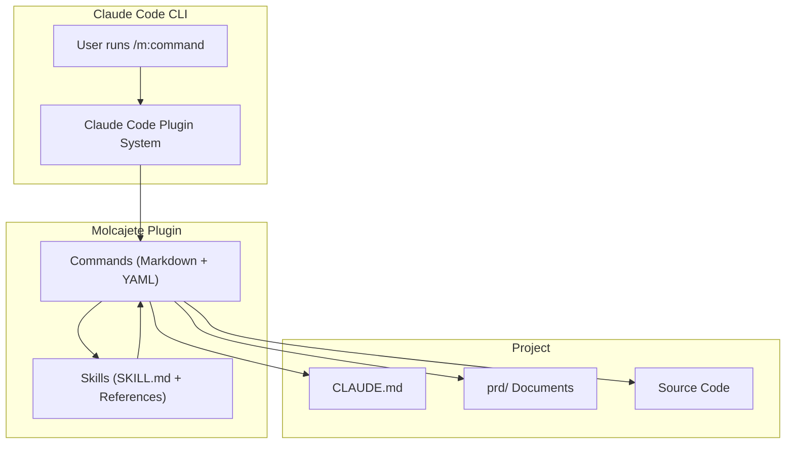

# Molcajete.ai Technology Stack

## Overview

Molcajete.ai is a pure Markdown-based plugin system with no runtime dependencies. The entire product is text files — commands defined as Markdown with YAML frontmatter, skills as knowledge documents with reference templates. This design choice is intentional: the plugin runs inside Claude Code's existing infrastructure and requires no build step, no server, and no package manager.

## Architecture



## Plugin System

### Structure

| Component | Format | Purpose |
|-----------|--------|---------|
| Plugin Manifest | `plugin.json` | Declares plugin name, version, commands, skills |
| Commands | Markdown with YAML frontmatter | Define slash commands with model, tools, and prompt |
| Skills | `SKILL.md` with YAML frontmatter | Provide domain knowledge and patterns |
| References | Markdown files in `references/` | Templates and examples used by skills |

### Command Format

| Field | Type | Purpose |
|-------|------|---------|
| `description` | String | Short description shown in command list |
| `model` | String | Preferred model (e.g., `opus`, `sonnet`) |
| `allowed-tools` | List | Tools the command is allowed to use |
| Body | Markdown | The full prompt template with instructions |

### Skill Format

| Field | Type | Purpose |
|-------|------|---------|
| `name` | String | Skill name |
| `description` | String | What the skill provides |
| Body | Markdown | Knowledge, conventions, and rules |
| `references/` | Directory | Template files the skill uses |

## Project Structure

```
molcajete.ai/
├── molcajete/                        # Core "m" plugin
│   ├── .claude-plugin/
│   │   └── plugin.json               # Plugin manifest
│   ├── commands/                      # 17 slash commands
│   │   ├── init.md                    # /m:init — product docs setup
│   │   ├── feature.md                 # /m:feature — scope features
│   │   ├── spec.md                    # /m:spec — technical specs
│   │   ├── tasks.md                   # /m:tasks — break specs into tasks
│   │   ├── dev.md                     # /m:dev — implement tasks
│   │   ├── fix.md                     # /m:fix — fix implemented tasks
│   │   ├── test.md                    # /m:test — write and run tests
│   │   ├── review.md                  # /m:review — code review
│   │   ├── doc.md                     # /m:doc — generate docs
│   │   ├── commit.md                  # /m:commit — structured commits
│   │   ├── amend.md                   # /m:amend — amend commits
│   │   ├── rebase.md                  # /m:rebase — interactive rebase
│   │   ├── debug.md                   # /m:debug — guided debugging
│   │   ├── research.md               # /m:research — deep research
│   │   ├── summary.md                # /m:summary — quick research
│   │   ├── copy.md                    # /m:copy — rewrite content
│   │   └── prompt.md                  # /m:prompt — write LLM prompts
│   └── skills/                        # 19 knowledge skills
│       ├── software-principles/       # SOLID, DRY, KISS, etc.
│       ├── dev-workflow/              # Development lifecycle
│       ├── project-management/        # PRD templates and ID schemes
│       ├── code-documentation/        # Documentation standards
│       ├── git-conventions/           # Commit and branching rules
│       ├── testing-patterns/          # Test strategies
│       ├── copywriting/               # Writing and tone
│       └── ...                        # Stack-specific skills (TS, Go, React, Node)
├── legacy/                            # v1 format migration helper (deprecated)
├── deprecated/                        # Archived v1 plugins (reference only)
└── prd/                               # Product documentation (this directory)
```

## Development Commands

### Plugin Development

```bash
claude /m:init         # Initialize product documentation for a project
claude /m:feature      # Scope a new feature into requirements
claude /m:spec         # Create technical specification
claude /m:tasks        # Break spec into implementation tasks
claude /m:dev          # Implement a task from the plan
claude /m:test         # Write, run, or analyze tests
claude /m:review       # Code review on changes
```

### Git Workflow

```bash
claude /m:commit       # Create structured commit
claude /m:amend        # Amend last commit
claude /m:rebase       # Interactive rebase helper
```

### Research and Writing

```bash
claude /m:research     # Deep research with parallel agents
claude /m:summary      # Quick web and local research
claude /m:copy         # Rewrite content with clear structure
claude /m:prompt       # Write well-structured LLM prompts
claude /m:doc          # Generate code documentation
```

## Standards and Conventions

### Document Format

- All product documents use Markdown with no emojis
- Text checkboxes only: `- [ ]` and `- [x]`
- Diagrams use Mermaid exclusively (no ASCII art)
- Structured data uses Markdown tables

### ID Scheme

- Use Cases: `UC-{tag}-NNN`
- User Stories: `US-{tag}-NNN`
- Functional Requirements: `FR-{tag}-NNN`
- Non-Functional Requirements: `NFR-{tag}-NNN`
- Tags generated via Base-62 algorithm from timestamps

### Estimation

- Story points on Fibonacci scale: 1 (trivial), 2 (small), 3 (medium), 5 (large), 8 (very large)
- Tasks exceeding 8 points must be split
- Vertical feature slicing — each task delivers complete, testable functionality through all layers
